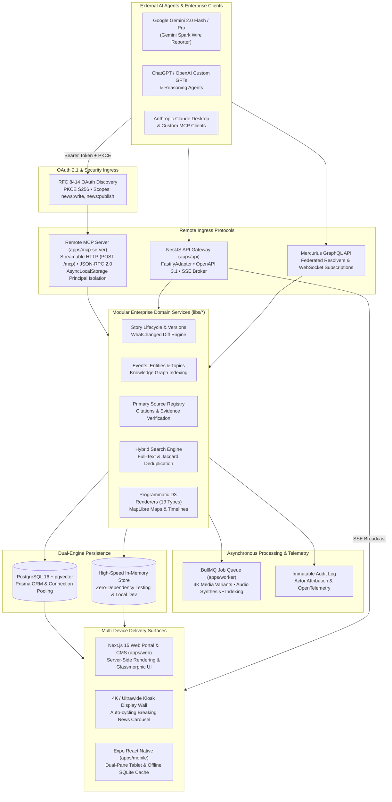
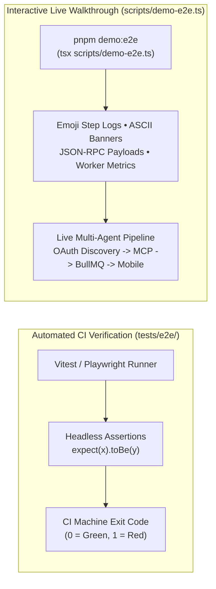

# GlobalPulse: AI-Operable Multimedia News Platform

[](https://www.typescriptlang.org/)
[](https://nextjs.org/)
[](https://fastify.dev/)
[](https://mercurius.dev/)
[](https://modelcontextprotocol.io/)
[](LICENSE)
[]()

A production-grade, modern, interactive, animated multimedia news publishing platform designed from the ground up as an **AI-operable application**. External AI agents—such as Google Gemini, Gemini Spark, ChatGPT / OpenAI agents, Claude, and enterprise MCP clients—operate the newsroom remotely through the **Model Context Protocol (MCP)** and **GraphQL Mercurius API**.

---

## 🏛️ Foundational Architectural Axiom

> ### **THE APPLICATION IS NOT THE AI**
> 
> The application itself is **NOT** an autonomous AI newsroom. The platform does **NOT** independently scrape the web, conduct investigative research, decide which world events matter, or run autonomous generative hallucination loops.
>
> Instead, **intelligence belongs exclusively to external AI models and human journalists**. The platform provides secure, strongly-typed, auditable, high-performance publishing infrastructure: structured block content models, cryptographic provenance attribution, dual-engine persistence (PostgreSQL / In-Memory), D3 visual renderers, MapLibre geospatial maps, real-time Server-Sent Events (SSE), and multi-client frontends across Web, Mobile (Expo), Tablet, and 4K Ultrawide Display Walls.

---

## 🌐 System Architecture



---

## 🌟 Key Features & Capabilities

### 1. Google News Production Parity
- **Personalized "For You" Feed**: Algorithmic ranking tailored to user reading history, followed entities, and topic interests, excluding already-read articles.
- **Story Clustering & Full Coverage**: Deep multi-perspective analysis grouping dispatches across publishers, chronological timeline of developments, and primary source verification audits.
- **Instant Search Autocomplete**: Sub-second typeahead search with categorized suggestions for Categories, Topics, Entities, and Stories.
- **Floating AI Audio Briefing Player**: In-browser text-to-speech audio reader with pulsing equalizer waveform, play/pause controls, and playback speed adjustment (`1.0x` to `2.0x`).
- **Real-time Live News Ticker**: Server-Sent Events (SSE) stream automatically pushes breaking dispatches and status updates without full-page reloads.

### 2. Human Editorial CMS & Newsroom Workflow
- **Structured 22-Block Engine**: Content is authored as composable, typed JSON blocks—including Lead Paragraphs, Pull Quotes, 13 D3 Charts, MapLibre Maps, Milestone Timelines, Comparison Tables, Callouts, and KPI Metric Statistics.
- **Compose & Live Article Preview**: Switch between form editing and a real-time dark/light preview rendered by the production `StoryRenderer`.
- **Revision Snapshots & WhatChanged Diffs**: Committing revisions creates immutable version snapshots with changelog diffs displayed automatically to readers.
- **Editorial Review Queue & Scheduled Embargo**: Multi-role review gates (Draft → Submit for Review → Approve/Publish) and automated embargo scheduling.

### 3. External AI Operability via Model Context Protocol (MCP)
- **40+ MCP Tools**: External AI models (Claude, ChatGPT, Gemini, or autonomous daemons) operate the newsroom via JSON-RPC 2.0 to report breaking news, create visual charts, link citations, and manage taxonomy.
- **OAuth 2.1 & RFC 8414 Authorization Server**: Full PKCE S256 code challenge verification and `client_credentials` grant with standard Bearer JWT issuance.
- **Token Context Optimization**: `includeBlocks: false` and `includeSummary: false` parameters allow external LLMs to list stories and inspect metadata without consuming excessive context window tokens.
- **Cryptographic Provenance**: Every story published by an AI carries transparent provenance tags (`createdByClient`, `clientType`, `authorId`).

---

## 📦 Monorepo Structure

```text
.
├── apps/
│   ├── api/             # Production Fastify + NestJS HTTP REST Gateway & OpenAPI 3.1
│   ├── mcp-server/      # Remote Model Context Protocol Server over Streamable HTTP
│   ├── web/             # Next.js 15 Web Portal, Human CMS, and 4K Ultrawide Display Wall
│   ├── mobile/          # Expo / React Native App (iOS, Android, Tablet dual-pane layout)
│   └── worker/          # Asynchronous Background Job Processor (Audio, Media, Search)
├── libs/
│   ├── schemas/         # Canonical Zod schemas for all 22 Story Blocks, Entities, Events
│   ├── database/        # Dual-engine repository (Prisma PostgreSQL + In-Memory Store)
│   ├── events/          # Developing Event domain service and milestone tracker
│   ├── entities/        # Named Entity domain service (People, Organizations, Countries)
│   ├── topics/          # News taxonomy classification and topic hierarchy
│   ├── sources/         # Primary source registry, fact-checking, and citation linker
│   ├── search/          # Jaccard similarity, full-text tokenization, deduplication
│   ├── media/           # D3 programmatic chart engine (13 types), MapLibre, Timelines
│   ├── graphql/         # Mercurius GraphQL schema, resolvers, and subscriptions
│   ├── auth/            # OAuth 2.1, PKCE verification, JWT token service, scopes
│   ├── jobs/            # Job queue manager, handlers, and retry backoff policies
│   ├── observability/   # Structured JSON logger, Prometheus metrics, OpenTelemetry
│   └── shared/          # Shared utilities, slugify, generateId, error hierarchy
├── docs/                # Comprehensive 26-file production documentation suite
├── tests/
│   ├── unit/            # Isolated unit test suites (Blocks, Renderers, Auth, Search)
│   ├── integration/     # Subsystem integration tests (API, DB, MCP, GraphQL, Web)
│   └── e2e/             # Playwright browser journeys & multi-agent publishing tests
└── scripts/
    └── demo-e2e.ts      # Multi-agent end-to-end publishing demonstration
```

---

## ⚡ Quickstart

### 1. Prerequisites
- Node.js `20.x` or `22.x` (ESM native support)
- `pnpm` `9.x` or `10.x`

### 2. Installation
```bash
git clone https://github.com/chahak/ai-news-generator.git
cd ai-news-generator
pnpm install
```

### 3. Running Services Locally

#### Option A: Running with Native Node.js & pnpm
```bash
# Start NestJS & GraphQL API Server (port 3000)
pnpm dev:api

# Start Remote MCP Server (port 3001)
pnpm dev:mcp

# Start Next.js 15 Web Portal, CMS & 4K Wall (port 3002)
pnpm dev:web

# Start Asynchronous BullMQ Background Worker
pnpm dev:worker

# Start Expo Mobile Development Server
pnpm dev:mobile
```

#### Option B: Running with Docker Compose (Section 154)
```bash
# Launch PostgreSQL (pgvector), Redis 7, MinIO S3, API, MCP Server, Web, and Worker
pnpm docker:up

# Check container health and running status
pnpm docker:status

# Stream aggregated container logs
pnpm docker:logs

# Teardown containers and networks
pnpm docker:down
```

### 4. Running the Test Suite & Demonstrations

```bash
# Run all 56 unit and integration test suites (432 tests)
pnpm test

# Run isolated unit tests
pnpm test:unit

# Run subsystem integration tests (API, GraphQL, MCP, DB, Web)
pnpm test:integration

# Run interactive multi-agent end-to-end publishing demonstration
pnpm demo:e2e

# Run Playwright browser end-to-end tests
pnpm test:e2e:browser
```

---

## 🎯 Architectural Invariant: Live Walkthrough Script vs. Automated CI Tests

A deliberate architectural decision separates **`scripts/demo-e2e.ts`** from **`tests/e2e/`**:



* **`tests/e2e/` (Automated CI Tests)**: Designed for continuous integration and automated GitHub Actions runners. Runs headlessly, evaluates strict boolean assertions, outputs silent TAP/JUnit XML reports, and immediately aborts the pipeline on failure.
* **`scripts/demo-e2e.ts` (Live Demonstration Script)**: Designed for human observation, executive demos, conference presentations, and terminal walkthroughs. Bootstraps an ephemeral in-memory environment, walks through the 9-step multi-agent publishing lifecycle (Gemini Spark discovering RFC 8414 metadata, MCP tool calls, BullMQ worker processing, and mobile caching), and prints rich formatted step summaries to `stdout`.

---

## 📚 Complete Documentation Suite

All system aspects are thoroughly documented under [`docs/`](file:///c:/Users/chaha/Projects/ai-news-generator/docs):

| Document | Description |
|:---|:---|
| [**Architecture**](file:///c:/Users/chaha/Projects/ai-news-generator/docs/architecture.md) | High-level system architecture, topological layers, and core design principles |
| [**Setup Guide**](file:///c:/Users/chaha/Projects/ai-news-generator/docs/setup.md) | Development workstation prerequisites, installation, and environment variables |
| [**Development Workflow**](file:///c:/Users/chaha/Projects/ai-news-generator/docs/development.md) | Monorepo conventions, code style, git hooks, and development scripts |
| [**Deployment Guide**](file:///c:/Users/chaha/Projects/ai-news-generator/docs/deployment.md) | Production Docker packaging, Kubernetes manifest guides, and 4K display wall signage |
| [**Database Architecture**](file:///c:/Users/chaha/Projects/ai-news-generator/docs/database.md) | Dual-engine design: PostgreSQL with Prisma ORM, migrations, and high-speed in-memory engine |
| [**Content Model**](file:///c:/Users/chaha/Projects/ai-news-generator/docs/content-model.md) | Structured block architecture, canonical schemas, and all 22 supported block types |
| [**Story Model & Versioning**](file:///c:/Users/chaha/Projects/ai-news-generator/docs/story-model.md) | Story lifecycle, revision snapshots, `WhatChanged` diffing, and audit trails |
| [**Multimedia & Visual Engines**](file:///c:/Users/chaha/Projects/ai-news-generator/docs/media-model.md) | Programmatic D3 charts (13 types), MapLibre geospatial maps, and timelines |
| [**Search & Deduplication**](file:///c:/Users/chaha/Projects/ai-news-generator/docs/search.md) | Full-text indexing, tokenization, Jaccard similarity, and vector embeddings |
| [**Publishing & Idempotency**](file:///c:/Users/chaha/Projects/ai-news-generator/docs/publishing.md) | Atomic status transitions, idempotency key guarantees, and real-time SSE |
| [**Model Context Protocol (MCP)**](file:///c:/Users/chaha/Projects/ai-news-generator/docs/mcp.md) | Model Context Protocol overview, Streamable HTTP transport, and JSON-RPC 2.0 |
| [**MCP Tools Catalog**](file:///c:/Users/chaha/Projects/ai-news-generator/docs/mcp-tools.md) | Complete reference for all 18 Section 38 tools with schemas and examples |
| [**MCP Resources**](file:///c:/Users/chaha/Projects/ai-news-generator/docs/mcp-resources.md) | URI schemes (`news://stories`, `news://events`, `news://entities`) and templates |
| [**MCP Prompts**](file:///c:/Users/chaha/Projects/ai-news-generator/docs/mcp-prompts.md) | Standardized editorial prompts (`story-creation`, `story-update`) |
| [**MCP Authentication**](file:///c:/Users/chaha/Projects/ai-news-generator/docs/mcp-authentication.md) | OAuth 2.1 protocol, RFC 8414 discovery, PKCE `S256`, and granular scopes |
| [**OpenAI & ChatGPT Integration**](file:///c:/Users/chaha/Projects/ai-news-generator/docs/openai-chatgpt.md) | ChatGPT Agent connectivity, Custom GPT configuration, and tool mappings |
| [**OpenAI ChatGPT Auth**](file:///c:/Users/chaha/Projects/ai-news-generator/docs/openai-chatgpt-auth.md) | Mutual OAuth 2.1 compliance with OpenAI MCP authentication requirements |
| [**OpenAI ChatGPT App UI**](file:///c:/Users/chaha/Projects/ai-news-generator/docs/openai-chatgpt-app.md) | Optional MCP App UI iframe and conversational block rendering |
| [**OpenAI ChatGPT Schedules**](file:///c:/Users/chaha/Projects/ai-news-generator/docs/openai-chatgpt-schedules.md) | Automated wire monitoring and scheduled editorial dispatches |
| [**Google Gemini Integration**](file:///c:/Users/chaha/Projects/ai-news-generator/docs/gemini.md) | Gemini 2.0 Flash / Pro integration architecture and multimodal capabilities |
| [**Gemini Spark Overview**](file:///c:/Users/chaha/Projects/ai-news-generator/docs/gemini-spark.md) | Gemini Spark autonomous breaking news wire reporter persona and workflow |
| [**Gemini Spark Skill**](file:///c:/Users/chaha/Projects/ai-news-generator/docs/gemini-spark-skill.md) | Antigravity IDE and SDK skill definitions for Gemini Spark |
| [**Gemini Spark Schedules**](file:///c:/Users/chaha/Projects/ai-news-generator/docs/gemini-spark-schedules.md) | Cron-based continuous ingestion schedules for real-time diplomatic dispatches |
| [**Security Architecture**](file:///c:/Users/chaha/Projects/ai-news-generator/docs/security.md) | Threat modeling, tenant isolation, rate limiting, SSRF defense, prompt injection mitigations |
| [**Observability & Telemetry**](file:///c:/Users/chaha/Projects/ai-news-generator/docs/observability.md) | Structured JSON logging, Prometheus metrics (`/metrics`), and OpenTelemetry tracing |
| [**Testing Strategy**](file:///c:/Users/chaha/Projects/ai-news-generator/docs/testing.md) | Testing pyramid: unit (Vitest), integration, browser E2E (Playwright), demo scripts |

---

## 🔒 License

This project is licensed under the [MIT License](LICENSE).
Crafted for enterprise newsrooms, automated intelligence platforms, and next-generation AI agent integrations.
