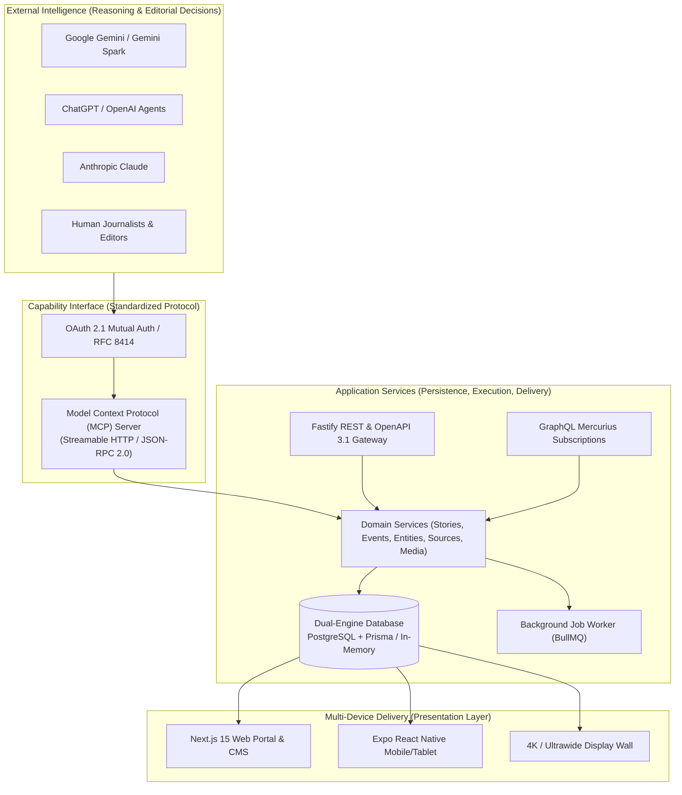
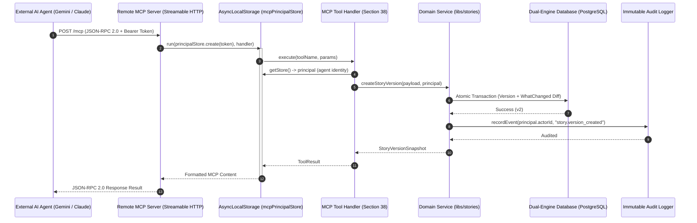
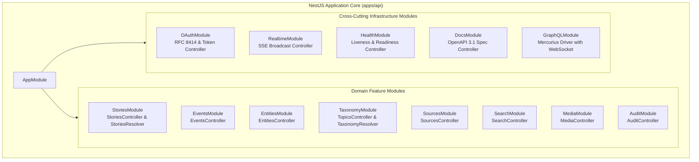

# System Architecture & Topological Design

This document details the architectural principles, topological tiers, and inter-service communications of the **GlobalPulse** multimedia news platform.

---

## 1. Foundational Axiom: "The Application is NOT the AI"

The core architectural invariant of this system is that **intelligence resides exclusively with external AI models and human editors**.

### What the Application DOES NOT Do:

- **No autonomous web scraping**: The platform does not crawl the web to find breaking news.
- **No generative hallucination loops**: The server does not invoke LLMs internally to rewrite articles or generate fictitious claims.
- **No autonomous news decisions**: The platform does not decide what news is important; external agents submit articles with verified sources.

### What the Application DOES Do:

- **Strict schema validation**: Enforces canonical Zod schemas on every structured block.
- **Revision snapshots & diffing**: Generates `what_changed` blocks detailing diffs across adjacent revisions.
- **Idempotency gates**: Prevents duplicate publish events or conflicting edits from concurrent agents.
- **Multi-device presentation**: Delivers rich interactive visualizations (D3, MapLibre, Timelines) seamlessly across Web, Mobile, and 4K displays.

---

## 2. Topological Layers

### 2.1 Ingress & Remote Protocol Tier

- **Remote MCP Server (`apps/mcp-server`)**:
  - Exposes Streamable HTTP endpoint `POST /mcp` implementing the MCP specification (`2024-11-05`).
  - Uses `AsyncLocalStorage` (`mcpPrincipalStore`) to isolate caller authentication credentials concurrently across asynchronous execution flows.
  - Exposes 18 standardized Section 38 tools (`create_story`, `update_story`, `append_blocks`, `create_source`, etc.).

- **NestJS API Gateway (`apps/api`)**:
  - Built on high-performance Fastify 5.x and pure NestJS dependency injection architecture.
  - Features dedicated decoupled feature modules, OpenAPI 3.1 controllers, and Mercurius GraphQL resolvers.

### 2.2 Domain Services Tier (`libs/*`)

- **`libs/schemas`**: Single source of truth containing Zod schemas for all 22 block types, entities, events, sources, and stories.
- **`libs/stories`**: Story lifecycle manager handling drafts, publication, unpublishing, archiving, and revision trees.
- **`libs/events`**: Real-world developing event aggregator, milestone tracker, and geographic epicenter mapper.
- **`libs/entities`**: Named entity knowledge graph (people, organizations, countries, technologies) with alias indexing.
- **`libs/sources`**: Primary source registry supporting permissible excerpt attribution and verification scores.
- **`libs/search`**: Hybrid search engine combining full-text tokenization, Jaccard similarity deduplication, and vector embeddings.
- **`libs/media`**: Programmatic visualization engine rendering 13 D3 chart types, MapLibre GL fallback maps, and interactive timelines.

### 2.3 Data & Persistence Tier (`libs/database`)

- **Dual-Engine Repository Abstraction**:
  - **Prisma Engine**: Enterprise relational PostgreSQL with `pgvector` extension for semantic indexing.
  - **In-Memory Engine**: High-speed, zero-dependency in-memory store for isolated unit testing, edge deployments, and local CI.
  - **Atomic Transactions**: Multi-entity transactional guarantees ensuring stories, versions, and audit logs update atomically.

### 2.4 Asynchronous Worker Tier (`apps/worker`, `libs/jobs`)

- **Background Queue Manager**:
  - Decouples heavy media processing, vector indexing, and audio generation from the real-time request path.
  - Implements exponential backoff retries and dead-letter queues.

### 2.5 Presentation Tier (`apps/web`, `apps/mobile`)

- **Next.js 15 Web Portal**:
  - Server-side rendering (SSR), dynamic App Router, and accessible Tailwind CSS 4 glassmorphic theme.
  - `StoryRenderer` component mapping all 22 block types to interactive visual widgets.
  - Human Editorial CMS (`/admin`) and AI Activity Audit Log (`/admin/audit`).
  - 4K Ultrawide Kiosk Display Wall (`/display`, `/kiosk`, `/wall`) with auto-cycling stories and live clock.
- **Expo React Native Mobile**:
  - True native component hierarchy (`View`, `Text`, `FlatList`, `ScrollView`, `StyleSheet`).
  - Adaptive dual-pane master-detail layout for tablets (`width >= 768px`) and stack navigation for mobile phones.
  - Persistent offline storage cache and audio briefing synthesis player.
