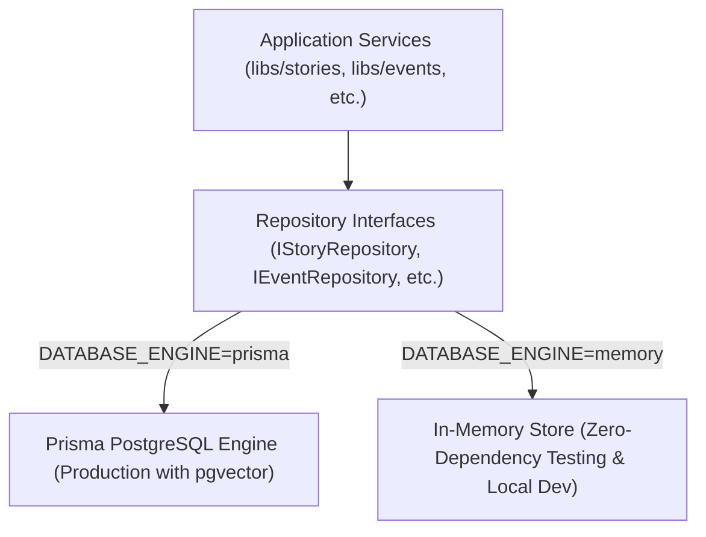
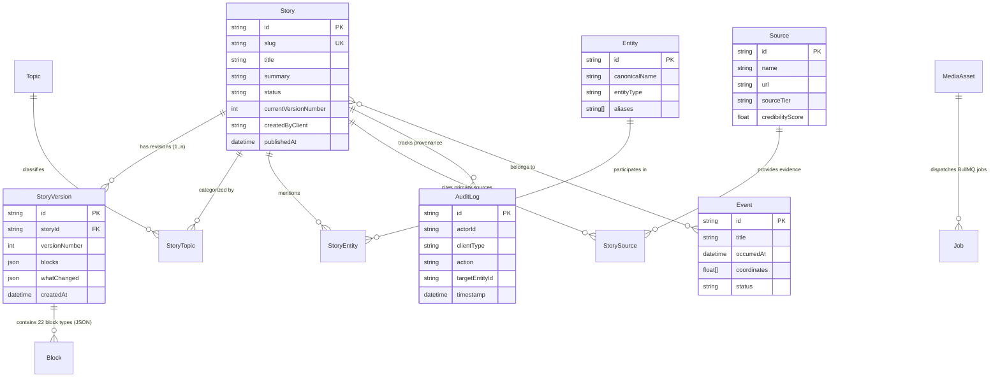

# Dual-Engine Database Architecture & Data Access Layer

This document details the dual-engine persistence layer implemented in `libs/database`, PostgreSQL schema design, Prisma ORM mappings, in-memory switching, and transaction management.

---

## 1. Dual-Engine Architecture

To enable high-speed local development, isolated test executions, and enterprise-grade production reliability, `libs/database` implements a **repository interface abstraction** with two drop-in engines:



### Engine Selection
The active engine is governed dynamically by the `DATABASE_ENGINE` environment variable:
* `DATABASE_ENGINE=prisma`: Connects to PostgreSQL using Prisma Client with connection pooling, retry policies, and slow-query telemetry.
* `DATABASE_ENGINE=memory` (default): Allocates isolated in-memory hash maps with indexing, Jaccard token similarity searching, and automatic demo seeder initialization.

---

## 2. PostgreSQL Relational Schema Design (`schema.prisma`)

The database consists of core entities with strict relational integrity, foreign key cascades, and unique constraints:



```prisma
datasource db {
  provider   = "postgresql"
  url        = env("DATABASE_URL")
  extensions = [pgvector(map: "vector")]
}

generator client {
  provider        = "prisma-client-js"
  previewFeatures = ["postgresqlExtensions"]
}

enum StoryStatus {
  DRAFT
  PUBLISHED
  ARCHIVED
  RETRACTED
}

enum EntityType {
  PERSON
  ORGANIZATION
  COUNTRY
  LOCATION
  TECHNOLOGY
  PRODUCT
  INSTITUTION
}

model Story {
  id                   String        @id @default(uuid())
  organizationId       String
  slug                 String        @unique
  title                String
  summary              String
  status               StoryStatus   @default(DRAFT)
  articleType          String
  currentVersionNumber Int           @default(1)
  currentVersionId     String?
  heroImageUrl         String?
  createdVia           String        @default("mcp")
  createdByClient      String
  authorId             String
  publishedAt          DateTime?
  createdAt            DateTime      @default(now())
  updatedAt            DateTime      @updatedAt

  versions             StoryVersion[]
  storyTopics          StoryTopic[]
  storyEntities        StoryEntity[]
  storySources         StorySource[]

  @@index([organizationId, status])
  @@index([publishedAt(sort: Desc)])
}

model StoryVersion {
  id            String   @id @default(uuid())
  storyId       String
  versionNumber Int
  title         String
  summary       String
  blocks        Json     // Serialized array of 22 structured StoryBlocks
  whatChanged   Json?    // Serialized WhatChangedBlock diff metadata
  authorId      String
  createdVia    String
  createdAt     DateTime @default(now())

  story         Story    @relation(fields: [storyId], references: [id], onDelete: Cascade)

  @@unique([storyId, versionNumber])
}

model Event {
  id             String    @id @default(uuid())
  organizationId String
  title          String
  summary        String
  status         String    @default("ACTIVE")
  occurredAt     DateTime
  location       String?
  coordinates    Float[]   // [longitude, latitude]
  topicIds       String[]
  entityIds      String[]
  storyIds       String[]
  sourceIds      String[]
  createdAt      DateTime  @default(now())
  updatedAt      DateTime  @updatedAt

  @@index([organizationId, status])
}

model Entity {
  id             String     @id @default(uuid())
  organizationId String
  name           String
  slug           String     @unique
  type           EntityType
  description    String?
  aliases        String[]
  avatarUrl      String?
  metadata       Json?
  createdAt      DateTime   @default(now())
  updatedAt      DateTime   @updatedAt

  @@index([organizationId, type])
}

model Source {
  id                 String   @id @default(uuid())
  organizationId     String
  url                String
  canonicalUrl       String?
  title              String
  publisher          String
  author             String?
  publishedAt        DateTime?
  retrievedAt        DateTime @default(now())
  language           String   @default("en")
  sourceType         String   @default("NEWS_ARTICLE")
  permissibleExcerpt String?
  verificationScore  Float    @default(1.0)
  createdAt          DateTime @default(now())
  updatedAt          DateTime @updatedAt
}

model IdempotencyRecord {
  id             String   @id @default(uuid())
  organizationId String
  key            String   @unique
  resourceType   String
  resourceId     String
  responseStatus Int
  responseBody   Json
  createdAt      DateTime @default(now())
  expiresAt      DateTime
}

model AuditLog {
  id             String   @id @default(uuid())
  organizationId String
  action         String
  entityType     String
  entityId       String
  actorId        String
  clientType     String
  metadata       Json?
  createdAt      DateTime @default(now())

  @@index([organizationId, createdAt(sort: Desc)])
}
```

---

## 3. Transaction Management

All critical multi-step operations (e.g., publishing a story, creating version snapshots, and recording compliance audit trails) execute inside atomic transactions managed by `TransactionManager`:

```typescript
import { TransactionManager } from '@ai-news/database';

await transactionManager.run(async (tx) => {
  // 1. Snapshot previous version
  await tx.storyVersions.create(versionSnapshot);

  // 2. Update parent story status
  await tx.stories.update(storyId, { status: 'PUBLISHED', currentVersionNumber: nextVersion });

  // 3. Record immutable audit record
  await tx.audit.record({
    action: 'STORY_PUBLISHED',
    entityType: 'Story',
    entityId: storyId,
    actorId: principal.actorId,
    clientType: principal.clientType,
  });
});
```

If any step fails or an unhandled exception occurs, the transaction rolls back cleanly, preventing database corruption.
