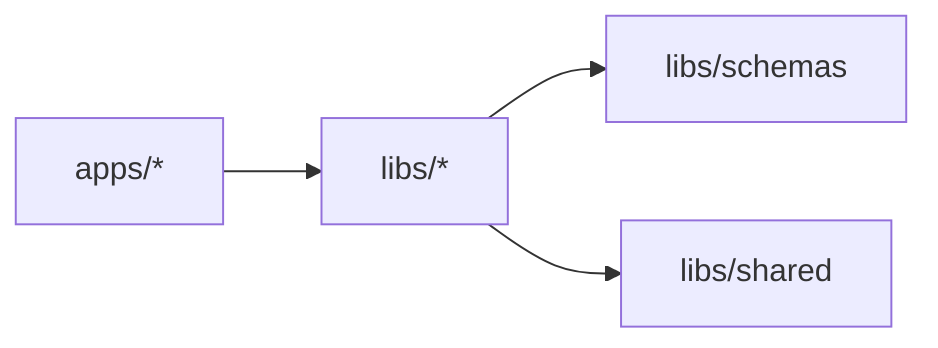

# Development Workflow & Monorepo Operations

This guide covers developer workflows, monorepo scripts, architectural boundaries, and contribution standards.

---

## 1. Monorepo Scripts Reference

All primary operations are accessible via `pnpm` scripts configured at the root:

| Command                 | Purpose                                                                              |
| :---------------------- | :----------------------------------------------------------------------------------- |
| `pnpm dev:api`          | Starts Fastify HTTP REST Gateway & Mercurius GraphQL API on port 3000                |
| `pnpm dev:mcp`          | Starts Remote MCP Server on port 3001 with Streamable HTTP transport                 |
| `pnpm dev:web`          | Starts Next.js 15 Web Portal, CMS & 4K Display Wall on port 3002                     |
| `pnpm dev:mobile`       | Starts Expo React Native bundler for mobile development                              |
| `pnpm dev:worker`       | Starts background job worker listening to queue events                               |
| `pnpm test`             | Runs the full Vitest unit and integration test suite (17 suites, 158 tests)          |
| `pnpm test:unit`        | Runs fast, isolated domain unit tests (`tests/unit`)                                 |
| `pnpm test:integration` | Runs subsystem integration tests (`tests/integration`)                               |
| `pnpm test:e2e`         | Runs multi-agent E2E journey tests                                                   |
| `pnpm test:e2e:browser` | Launches Playwright browser E2E test runner                                          |
| `pnpm demo:e2e`         | Runs programmatic end-to-end multi-agent publishing scenario (`scripts/demo-e2e.ts`) |
| `pnpm build`            | Compiles all TypeScript packages and Next.js web application for production          |
| `pnpm lint`             | Runs ESLint static analysis across all workspaces                                    |

---

## 2. Workspace Architecture & Boundaries

The codebase follows strict topological boundaries:



### Dependency Rules:

1. **`libs/schemas`** contains only pure Zod definitions and TypeScript types. It must never depend on database clients, HTTP frameworks, or React.
2. **`libs/database`** exposes interface contracts in `interfaces/*.ts`. Callers code to the repository interfaces, enabling frictionless switching between Prisma and In-Memory implementations.
3. **`apps/mcp-server`** depends only on domain libraries and `@modelcontextprotocol/sdk`. It never includes client UI code.
4. **`apps/web`** consumes `@ai-news/media` for D3 chart rendering and `@ai-news/schemas` for block parsing.

---

## 3. Working with Stories & Blocks

When adding or modifying story blocks:

1. Update `libs/schemas/src/story.ts` with the new block variant.
2. Update the discriminant union `StoryBlockSchema`.
3. Add the programmatic visual renderer in `libs/media`.
4. Update `StoryRenderer.tsx` in `apps/web` to render the block for web readers.
5. Update `MobileBlockRenderer.tsx` in `apps/mobile` to render the native React Native view.
6. Add unit test cases in `tests/unit/blocks/blocks.test.ts`.

---

## 4. Concurrency & Principal Isolation in MCP

When writing MCP tools:

- Never store agent state in global module variables.
- Always read caller identity and scopes through `mcpPrincipalStore.getStore()`:

```typescript
import { mcpPrincipalStore } from '../server.js';

export async function handleCreateStory(input: CreateStoryInput) {
  const principal = mcpPrincipalStore.getStore();
  if (!principal) {
    throw new Error('Unauthorized: Missing principal context');
  }

  // principal.clientId identifies the caller (e.g. 'gemini_spark', 'chatgpt')
  // principal.scopes verifies granted permissions
}
```
