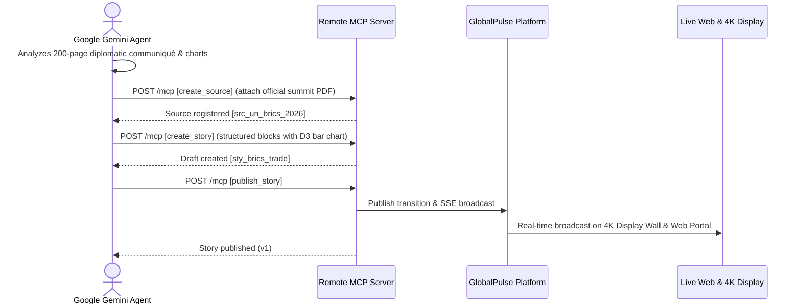

# Google Gemini & Gemini Spark Integration Architecture

This document details integrating Google Gemini models (Gemini 2.0 Flash, Gemini Pro, and Gemini Spark) with GlobalPulse via the remote Model Context Protocol (MCP).

---

## 1. Google Gemini Multimodal News Ingestion

Google Gemini models excel at multimodal analysis (satellite imagery, financial PDF reports, broadcast audio).

---

## 2. Gemini Spark Breaking News Persona

**Gemini Spark** operates as an automated senior diplomatic breaking wire correspondent:
* Configured with high-frequency cron schedules (`*/5 * * * *`).
* Inspects active developing events via `news://events`.
* Formulates structured revisions using `what_changed` blocks.
* Cites official primary documents with high verification confidence ratings.

For detailed skills and schedule configs, see:
* [`docs/gemini-spark.md`](file:///c:/Users/chaha/Projects/ai-news-generator/docs/gemini-spark.md)
* [`docs/gemini-spark-skill.md`](file:///c:/Users/chaha/Projects/ai-news-generator/docs/gemini-spark-skill.md)
* [`docs/gemini-spark-schedules.md`](file:///c:/Users/chaha/Projects/ai-news-generator/docs/gemini-spark-schedules.md)
