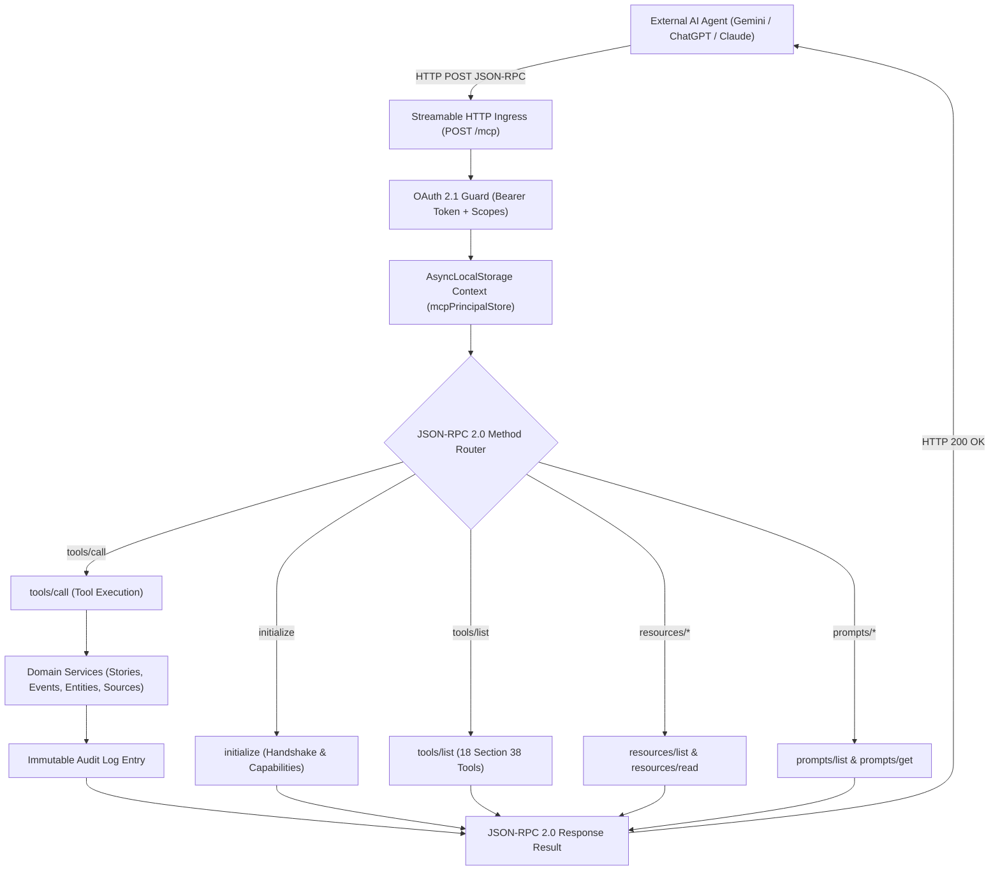

# Remote Model Context Protocol (MCP) Server Architecture

This document describes the remote **Model Context Protocol (MCP)** server architecture implemented in `apps/mcp-server` adhering to the official specification (`2024-11-05`).

---

## 1. Remote Streamable HTTP Transport

Unlike local desktop MCP tools that communicate via standard input/output (`stdio`), GlobalPulse operates as a **Remote Enterprise MCP Server** over **Streamable HTTP**:

* **Endpoint**: `POST /mcp`
* **Content-Type**: `application/json`
* **Protocol**: JSON-RPC 2.0
* **Mutual Authentication**: OAuth 2.1 Bearer Token with PKCE S256 verification and RFC 8414 Protected Resource discovery.



---

## 2. Concurrency & Principal Isolation via `AsyncLocalStorage`

When multiple external AI agents (e.g. Google Gemini, ChatGPT, and Claude) execute tool calls simultaneously over HTTP, their authentication context, client identities, and granted scopes must remain completely isolated without cross-talk or race conditions.

GlobalPulse achieves this through Node.js `AsyncLocalStorage`:

```typescript
// apps/mcp-server/src/server.ts
export const mcpPrincipalStore = new AsyncLocalStorage<McpPrincipal>();

app.post('/mcp', async (req, reply) => {
  const token = extractBearerToken(req);
  const principal = await verifyAndResolvePrincipal(token);

  // Bind principal to asynchronous execution tree
  return mcpPrincipalStore.run(principal, async () => {
    return handleJsonRpcRequest(req.body);
  });
});
```

Every downstream tool execution reads the authenticated principal via `mcpPrincipalStore.getStore()`, ensuring zero data leakage between concurrent agents.

---

## 3. Server Capabilities

The server announces the following capabilities during the MCP `initialize` handshake:

```json
{
  "capabilities": {
    "tools": {
      "listChanged": true
    },
    "resources": {
      "subscribe": true,
      "listChanged": true
    },
    "prompts": {
      "listChanged": true
    },
    "logging": {}
  },
  "serverInfo": {
    "name": "globalpulse-mcp-server",
    "version": "1.0.0"
  }
}
```
