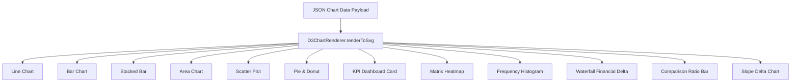

# Multimedia & Visual Story Engines (`libs/media`)

This document details the programmatic visualization engines implemented in `libs/media`: the 13 D3 chart renderers, MapLibre geospatial engine, responsive timelines, and audio synthesis pipelines.

---

## 1. D3 Programmatic Chart Engine (`D3ChartRenderer`)

External AI agents generate charts by returning structured JSON datasets instead of generating raster bitmap images or fragile SVG strings.

The `D3ChartRenderer` renders 13 complete chart types to clean, accessible, zero-dependency SVG strings on the server:

### Complete 13 Chart Types Supported:
1. **`line`**: Time-series trends with multi-series line tracks, data points, and value labels.
2. **`bar`**: Discrete category comparisons with value badges and attribution footnotes.
3. **`stacked_bar`**: Multi-segment composition bars with normalized scale calculation.
4. **`area`**: Continuous cumulative volumes with gradient fill and stroke contours.
5. **`scatter`**: Correlation bivariate distribution with radius encoding.
6. **`pie`**: Proportional distribution segments with radial arc paths.
7. **`donut`**: Radial ring distribution with center summary callout.
8. **`kpi`**: High-impact executive scorecard metric cards with delta percentages.
9. **`heatmap`**: Matrix heat grid encoding numerical density across category axes.
10. **`histogram`**: Frequency distribution binned across numerical intervals.
11. **`waterfall`**: Sequential positive and negative cash/volume flows with baseline bridge.
12. **`comparison`**: Side-by-side proportional ratio bars with percentage indicators.
13. **`slope`**: Paired pre/post slope comparison lines highlighting directional trajectories.

---

## 2. Geospatial Map Engine (`MapRenderer`)

The `MapRenderer` renders geospatial visualizations with zero external network dependencies:
* **Interactive Client Layer**: Renders high-performance vector tiles via MapLibre GL on Web and native maps on Mobile.
* **Declarative Fallback Layer**: Renders standalone SVG maps with stylized globe latitude/longitude grids, reticle crosshairs, layer badges (`fill`, `line`, `circle`, `heatmap`), zoom factor indicators, and projected markers.

---

## 3. Responsive Timeline Engine (`TimelineRenderer`)

Timelines convey diplomatic and breaking milestone sequences across dynamic aspect ratios:
* **Horizontal Mode (`desktop` / `display wall`)**: Renders horizontal chronological track with milestone nodes, dates, headlines, and connecting conduits.
* **Vertical Mode (`mobile` / `tablet`)**: Renders vertical numbered spine with dynamic SVG height calculation based on item count.

---

## 4. Audio Briefing Synthesis Pipeline

When stories publish, the background worker invokes the audio generator:
* **Input**: Executive summary and lead narrative paragraphs.
* **Processing**: Estimates speech cadence (150 words/min) and triggers neural text-to-speech voice generation (`news_anchor_f`, `diplomatic_briefing_m`).
* **Artifact**: Streamable `.m4a` / `.mp3` podcast file attached as an `audio` block for commute playback.
