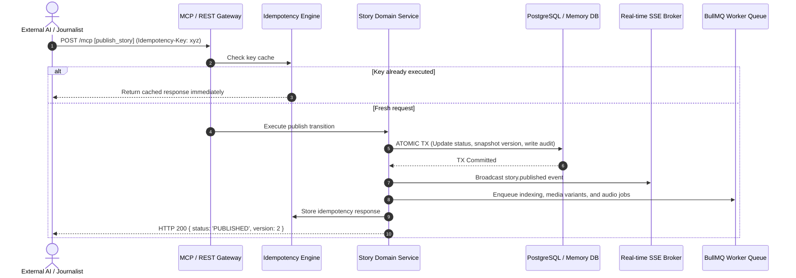

# Publishing Engine, Idempotency & Real-Time Broadcast

This document details the atomic publishing lifecycle, idempotency key guarantees, Server-Sent Events (SSE) broadcast, and syndication webhooks.

---

## 1. Atomic Publishing Pipeline

Publishing is a multi-step operation guaranteed by atomic database transactions:

---

## 2. Idempotency Key Guarantees

Network blips or timeout retries from external AI clients could inadvertently trigger duplicate publish operations. GlobalPulse implements RFC 7231 compliant idempotency filtering:

* Callers provide a unique UUID `Idempotency-Key` header (or input property).
* The key is hashed and checked against `IdempotencyRecord` table.
* Subsequent calls within the 24-hour retention window return the identical response payload without re-running side effects.

---

## 3. Real-Time Broadcast via Server-Sent Events (SSE)

The platform streams real-time news updates directly to Web readers and 4K display walls:

* **Endpoint**: `GET /api/v1/realtime/stream?channels=stories:published,breaking:declared`
* **Features**:
  * Channel-based subscriptions (`stories`, `topics`, `breaking`).
  * Automatic 15-second heartbeat keepalives (`:keepalive\n\n`) to prevent proxy timeout disconnections.
  * Instant UI reconciliation on the 4K display wall when an external AI submits a breaking dispatch.
