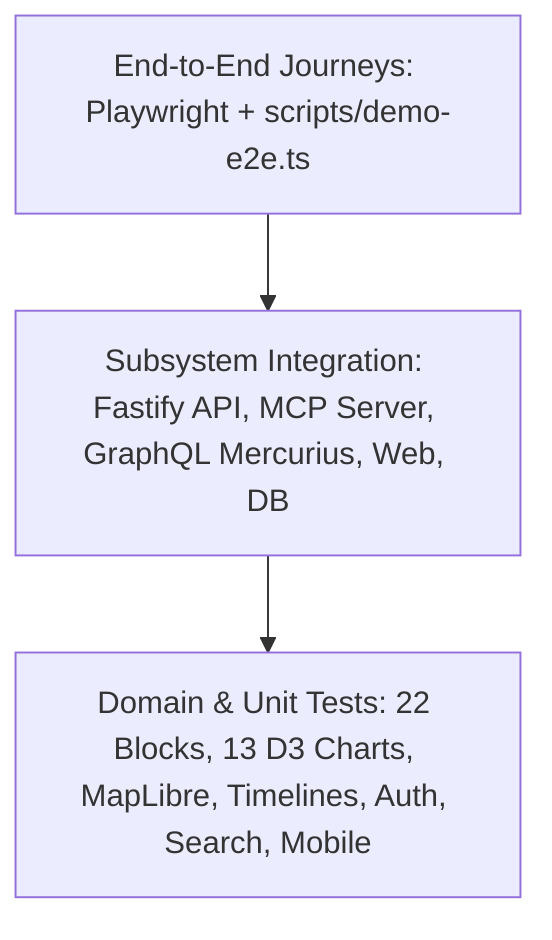

# Enterprise Testing Strategy & Quality Assurance Architecture

This document describes the testing pyramid, test suites organization, Vitest configuration, and Playwright browser E2E test execution for **GlobalPulse**.

---

## 1. The Enterprise Testing Pyramid



---

## 2. Test Taxonomy & Directory Structure

All tests reside under the root `tests/` directory:

```text
tests/
├── unit/
│   ├── blocks/blocks.test.ts                 # Validates 22 block schemas and diff calculations
│   ├── visual-renderers/visual-renderers.test.ts # 13 D3 chart renderers, maps, timelines
│   ├── stories/story-service.test.ts          # Story lifecycle, version snapshots
│   ├── search/search-service.test.ts          # Jaccard text similarity and scoring
│   ├── api/guards-and-errors.test.ts          # OAuth scope guards, RFC 7807 error responses
│   ├── auth/auth-service.test.ts              # JWT signing, PKCE challenge verification
│   ├── domain/domain-services.test.ts         # Events, Entities, Topics, Sources services
│   ├── jobs/queue-and-workers.test.ts         # Worker handlers for media, search, and audio
│   ├── mobile/offline-storage.test.ts         # Mobile offline cache and read history
│   └── mobile/mobile-components.test.ts       # Native React Native component rendering
│
├── integration/
│   ├── api/api-gateway.test.ts                # Fastify REST endpoints, CRUD, SSE
│   ├── database/database.test.ts              # Dual-engine switching (Prisma / Memory), seeder
│   ├── mcp/mcp-server.test.ts                 # Remote MCP Streamable HTTP, principal isolation
│   ├── graphql/graphql-api.test.ts            # Mercurius GraphQL queries, mutations, subscriptions
│   ├── publishing/idempotency-audit.test.ts   # Idempotency gates, atomic transactions
│   ├── realtime/sse-broker.test.ts            # SSE channel broadcasting and heartbeats
│   └── web/web-renderer-cms.test.ts           # Next.js StoryRenderer, 4K wall, entity/event pages
│
└── e2e/
    ├── multi-agent-publishing.e2e.test.ts     # Multi-agent publishing journey
    ├── web-portal.spec.ts                     # Playwright: Portal, story reader, 4K wall
    └── cms-workflow.spec.ts                   # Playwright: Journalist CMS, revision diffs
```

---

## 3. Running Test Suites

### 3.1 Fast Local Unit Tests
```bash
pnpm test:unit
```

### 3.2 Subsystem Integration Tests
```bash
pnpm test:integration
```

### 3.3 Full Test Suite (17 Suites, 158 Tests)
```bash
pnpm test
```

### 3.4 Multi-Agent End-to-End Demonstration Script
```bash
./node_modules/.bin/tsx scripts/demo-e2e.ts
```

### 3.5 Browser End-to-End Tests (Playwright)
```bash
pnpm test:e2e:browser
```
